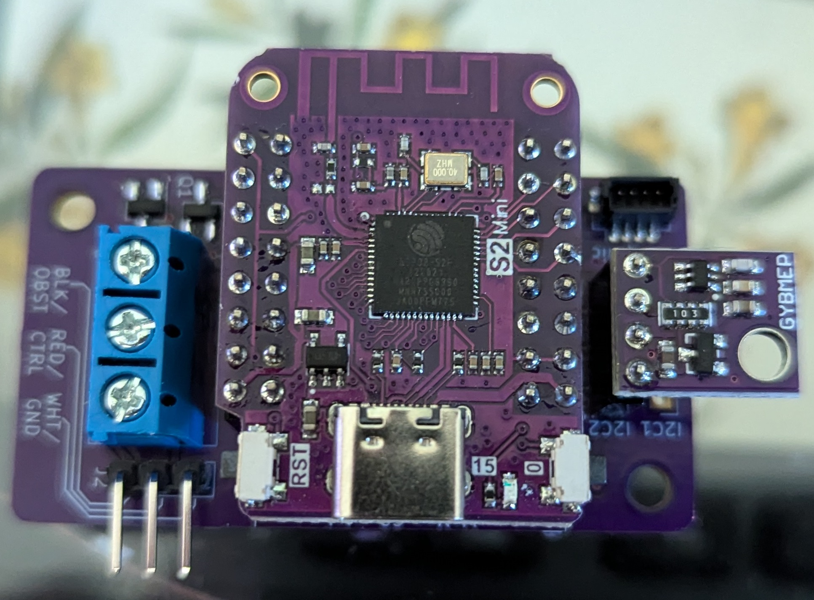

## Overview
This is a rat-ratgdo carrier board for a [Wemos S2 mini](https://www.wemos.cc/en/latest/s2/s2_mini.html). In addition to standard ratgdo functionality, it breaks out 2 I2C buses (one with a Qwiic/Stemma compatible connector) as well as a UART for use with other sensors.

_Assembled board with S2 mini and BME280 module mounted_

[Get boards from OSHPark](https://oshpark.com/shared_projects/v4UJMWZY)

[ESPHome YAML](garage-door.yaml)